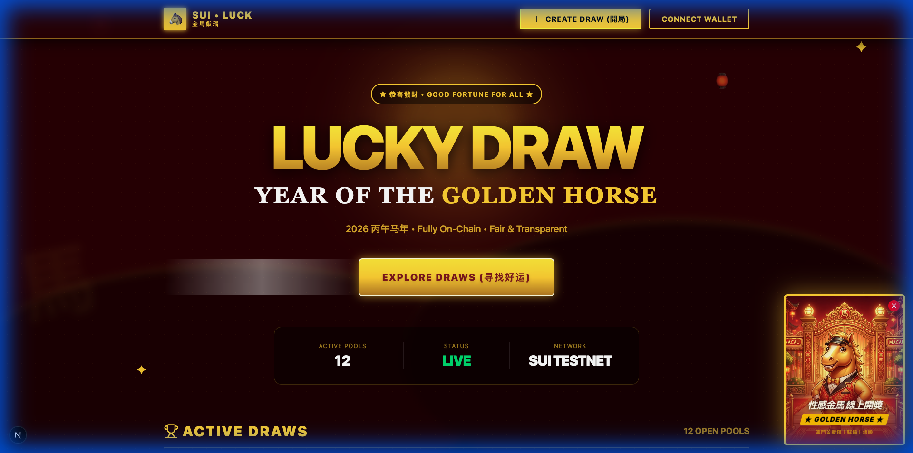
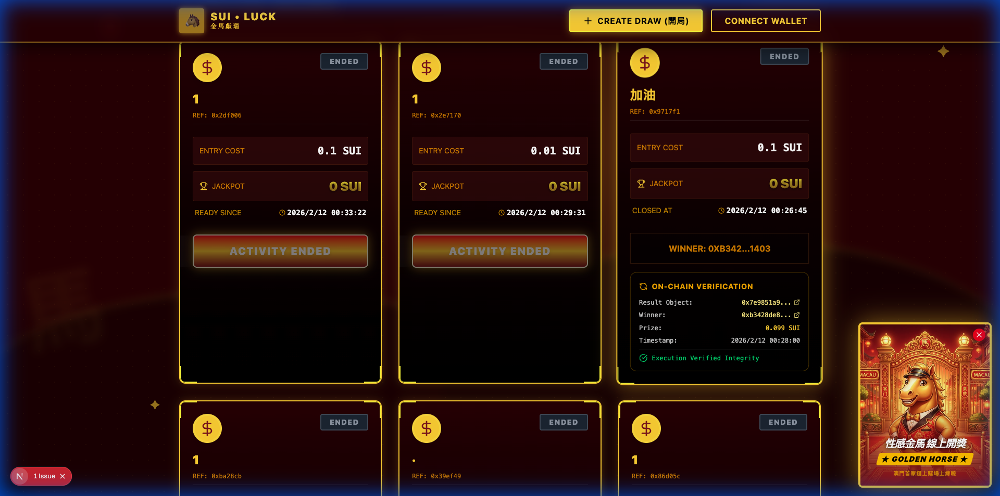
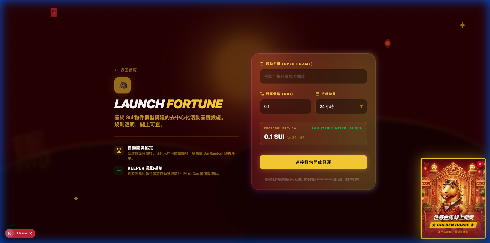
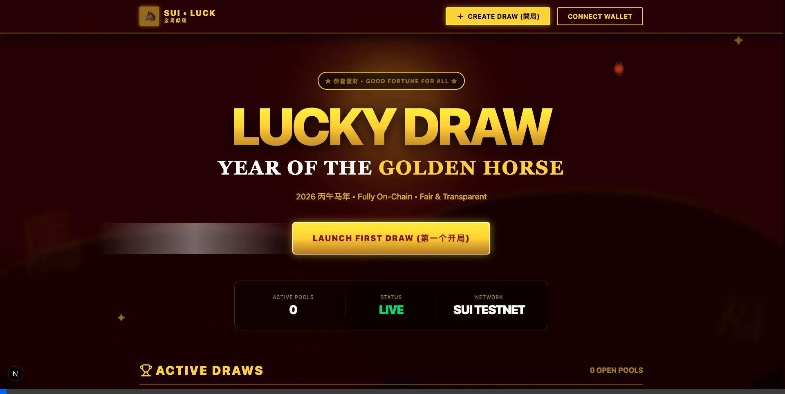

# 🐴 Sui Luck - Year of the Golden Horse 🧧

A high-end, decentralized community activity infrastructure built on the **Sui Network**. This project transforms reward distribution into a verifiable, replayable, and transparent on-chain process, wrapped in a festive **Macau Casino** aesthetic for the 2026 Year of the Golden Horse.


## 🌟 Key Features

### 🏛️ Decentralized Infrastructure

- **ActivityPool**: Every draw is a first-class Sui object, ensuring permanent records.
- **ParticipationTicket**: User participation generates unique NFT-like tickets.
- **Sui Random**: Winner selection is fully automated and tamper-proof using the native Sui Randomness beacon.

### 🎰 Luxury Casino Aesthetic

- **Macau Style**: A premium red-and-gold theme inspired by luxury casinos.
- **Casino Ad Component**: Festive "Golden Horse" mascot pop-ups with one-click viral sharing to X (Twitter).
- **Smooth Animations**: High-performance UI with fluid backgrounds and glassmorphism.



### 📣 Viral Social Mechanics

- **One-Click Share to X**: The "Sexy Golden Horse" ad isn't just a static popup—it's a social growth engine.
- **Pre-filled Viral Content**: Automatically generates high-conversion tweets about Sui luck and fair draws.
- **Social Proof**: Encourages users to "Brag" about their tickets and upcoming jackpots.

### 💎 Keeper Incentive Mechanism

- **Permissionless Execution**: Anyone can trigger a draw once it's due.
- **1% Reward**: The "Keeper" who triggers the draw automatically receives 1% of the prize pool to cover gas and provide an incentive.



## 🛠️ Technology Stack

- **Smart Contract**: Move (Sui Framework)
- **Frontend**: Next.js 16, TypeScript, Tailwind CSS
- **Wallet Integration**: `@mysten/dapp-kit`
- **Data Fetching**: `@tanstack/react-query`
- **Icons**: Lucide React

## 🚀 Getting Started

### Prerequisites

- [Sui CLI](https://docs.sui.io/guides/developer/getting-started/sui-install)
- Node.js & npm

### Smart Contract Deployment

```bash
cd contract
sui client publish --gas-budget 100000000
```

### Frontend Setup

1. Update `PACKAGE_ID` in `frontend/src/app/constants.ts` with your deployed package ID.
2. Install dependencies:
   ```bash
   cd frontend
   npm install
   ```
3. Run development server:
   ```bash
   npm run dev
   ```



## 📺 Demo Flow



## 📜 Technical Architecture

Following the **Sui Community Activity Infrastructure** PRD, the project models the entire lifecycle as object evolutions:

1. **Create**: `ActivityPool` shared object created.
2. **Join**: `ParticipationTicket` minted and given to user.
3. **Execute**: `RewardResult` immutable object created; funds distributed via `RewardRule` logic.

## 🐴 Year of the Golden Horse Special

"馬到功成" (Success with the arrival of the horse). This dApp is a gift to the Sui community for the 2026 festive season.

---

Built with ❤️ for the Sui Ecosystem.
